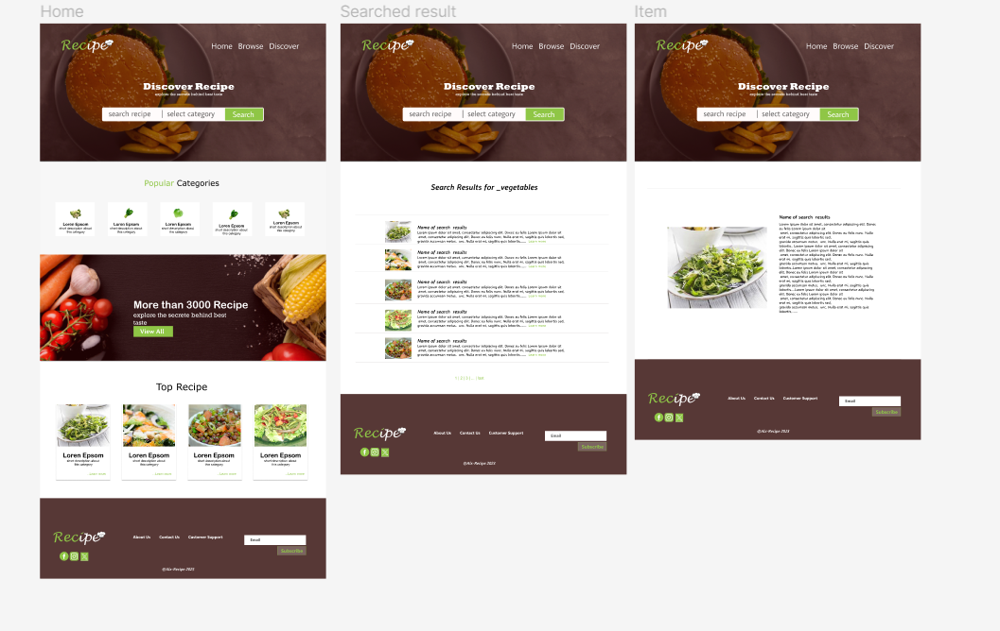

# Recipe Finder Web Application

## Project Overview:

The Recipe Finder Web Application is a user-friendly platform designed to simplify the process of discovering recipes tailored to individual preferences and ingredient availability. The project aims to address the challenge of meal planning by providing a customizable solution that empowers users to explore diverse recipes based on ingredients, dietary preferences, and cuisine choices.

## Features and Functionality:

- **Ingredient-based Search:** Users can input available ingredients, and the application suggests recipes that can be prepared with those ingredients.
  
- **Dietary Preferences:** Filter recipes based on dietary preferences such as vegetarian, vegan, gluten-free, etc.
  
- **Cuisine Selection:** Explore recipes from specific regions or cultures by filtering based on cuisine.
  
- **Recipe Details:** View detailed information about each recipe, including ingredients, step-by-step instructions, and nutritional information.
  
- **Visual Appeal:** Engaging user interface designed for an enjoyable browsing experience.
  
- **External API Integration:** Real-time data fetched from a recipe API ensures an extensive and diverse recipe database.
  

## Technologies Used:

- **Frontend:** HTML, CSS, JavaScript
- **Backend:** Flask (Python)
- **External API:** Edamam API

## Screenshots or Demo:

## Roadmap and Future Enhancements:

Future plans for the Recipe Finder Web Application may include:

- **Database:** feactures that allows users to save favourite recipe.

- **User Accounts:** Allow users to create accounts for personalized recipe recommendations.

- **Bookmark and Save:** Users can bookmark or save their favorite recipes for future reference.

- **Responsive Design:** Accessible and user-friendly across various devices.
  
- **Advanced Search Filters:** Implement additional filters for more refined recipe searches.
  
- **Community Features:** Enable users to share their own recipes and experiences.
  
- **Performance Optimizations:** Enhance the application's speed and efficiency.

## Contact Information:

- **Author:** Abel Enagbonmhena
- **Email:** ab.bell205@gmail.com
- **Portfolio:** NA
- **LinkedIn:** http://linkedin.com/in/enagbonmhena205
- **GitHub:** https://github.com/ab-abel
